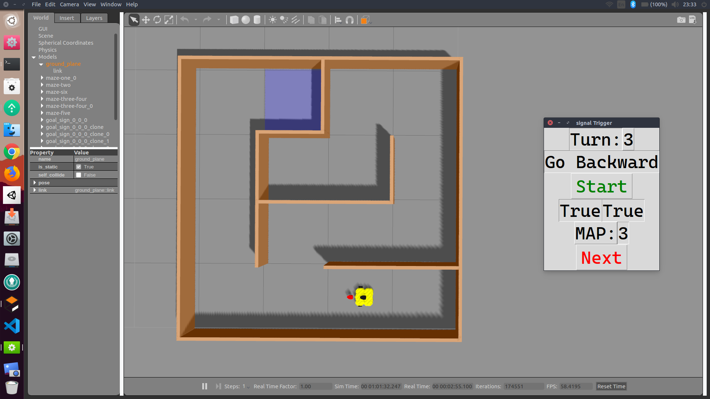

# Turtlebot Tutorial (Maze game)


## Robotics Part

### Test Algorithm

1. Open 2 Terminal (Alt + Ctrl + T)

2. On the first terminal, Run gazebo. If success, the map will appear on screen.
```
roslaunch turtlebot3_gazebo multi_turtlebot3.launch
```

2. On the second terminal, change to working directory.
```
cd /home/user1/ttb_ws/src/turtlebot3_simulations/turtlebot3_gazebo/src/py
```

3. On the second terminal, Run python to control turtlebot.
```
python ttb_template.py
```

#### Example
there are three example just_go.py, look_once_and_run.py, messy.py. Try to adapt a code from example to create your TTB

### Running 8 Turtlebot

1. Open 3 Terminal (Alt + Ctrl + T)

2. On the first terminal, Run gazebo. If success, the map will appear on screen.
```
roslaunch turtlebot3_gazebo multi_turtlebot3.launch
```

2. On the second terminal, change to working directory.
```
cd /home/user1/ttb_ws/src/turtlebot3_simulations/turtlebot3_gazebo/src/py
```

3. On the second terminal, Run python to open scoreboard.
```
python scoreboard.py
```

4. On the third terminal, Run 8 script together.
```
roslaunch turtlebot3_gazebo run_8_bot.launch
```
---
## Brain Part

0. For MUSE part follow these step [MUSE INSTALLATION](https://github.com/IoBT-VISTEC/KVIS-SciFair/tree/master/turtlebot3_simulations/turtlebot3_gazebo/src/py/muse_sci_fair-master/muse_sci_fair).

1. Open 4 Terminal (Alt + Ctrl + T)

2. On the first terminal, Run gazebo. If success, the map will appear on screen.
```
roslaunch turtlebot3_gazebo maze_test.launch 
```

2. On the second terminal, Run ROSBridge to communicate with Windows.
```
roslaunch rosbridge_server rosbridge_websocket.launch
```

3. On the third terminal, change to working directory.
```
cd /home/user1/ttb_ws/src/turtlebot3_simulations/turtlebot3_gazebo/src/py
```

4. On the third terminal, Run python to open control UI.
```
python signalTrigger.py
```

5. On the fourth terminal, change to working directory.
```
cd /home/user1/ttb_ws/src/turtlebot3_simulations/turtlebot3_gazebo/src/py
```

6. On the fourth terminal, Run python to open drive logic.
```
python manual_drive.py
```


