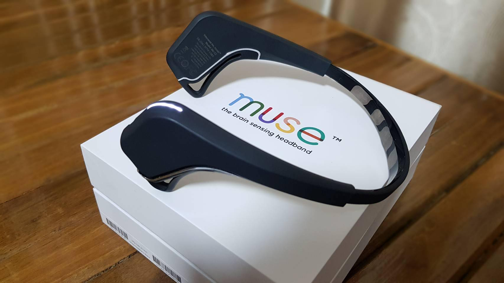
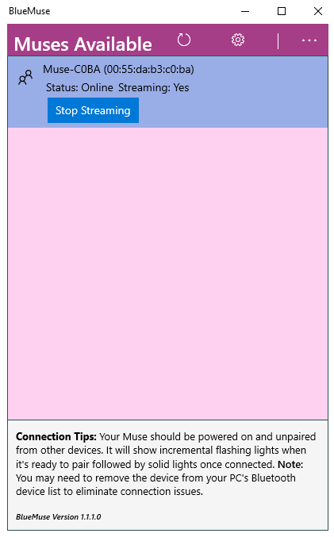
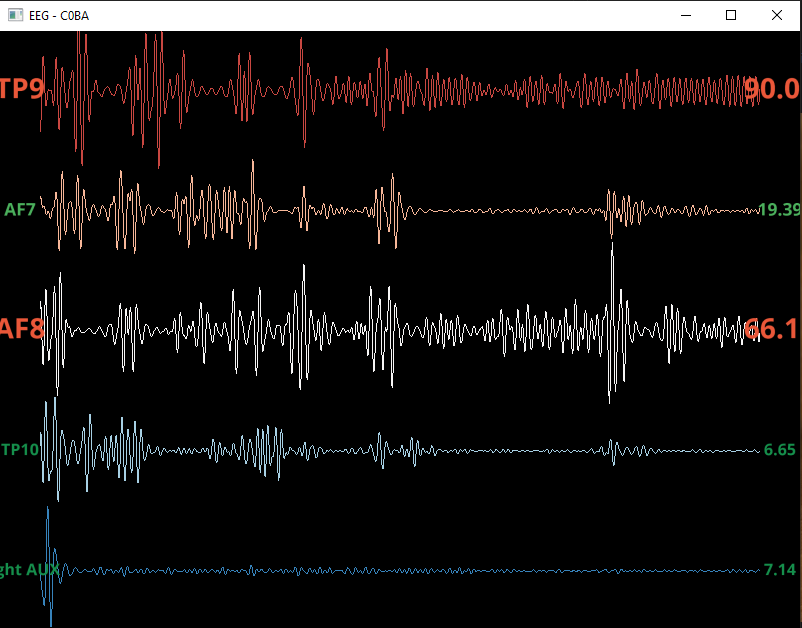

# Muse Sci-fair

This project used muse headband with bluemuse and muselsl to connect with the robotic's part (https://github.com/BAXMAY/ROBOTICS-FAIR/tree/master/turtlebot3_simulations/turtlebot3_gazebo/src/py) via ROS protocol

## Requirements

- Bluemuse (https://github.com/kowalej/BlueMuse)
- Python 3.7.x
- 2 x muse headband (https://choosemuse.com/)


## Getting Started

1. Run bluemuse and connect to muses



2. Install all dependencies via python3-pip
    ```
        pygatt
        pylsl
        bitstring
        vispy
        seaborn
        pyqt5
    ```

3. Change muse serial from the last 4 digits in showview.py , showview2.py
for example
```python
    viewer_v2.view('XXXX')
```

change XXXX into last 4 digit of muse serial (ex. C0BA)

4. Change muse serial from the last 4 digits in main_view.py (same 2 serial from above) and change ros host ip to the Robotic PC that run rosbridge
```python
    self.ros_client = Ros(host='10.205.240.32', port=9090)  
    .
    .
    .
    self.muse_left = "XXXX"
    self.muse_right = "YYYY"
```

5. Start all code by running three files

```
    showview_left.py
    showview_right.py
    main_view.py
```

6. If the installation is successful you should see the graphs running



### This project is implemented based on muse-lsl 
> Alexandre Barachant, Dano Morrison, Hubert Banville, Jason Kowaleski, Uri Shaked, Sylvain Chevallier, & Juan Jesús Torre Tresols. (2019, May 25). muse-lsl (Version v2.0.2). Zenodo. http://doi.org/10.5281/zenodo.3228861